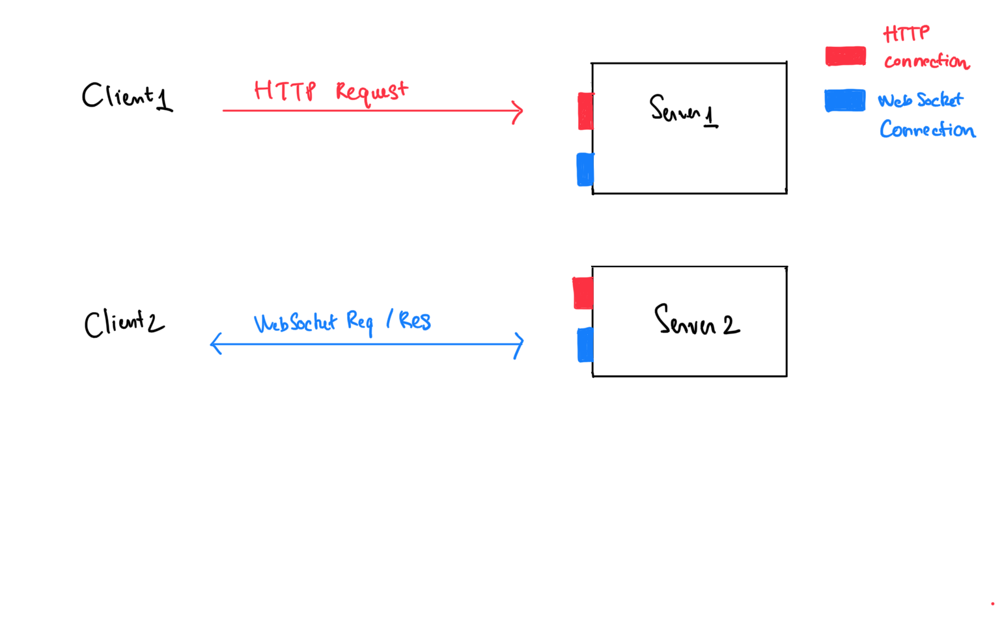
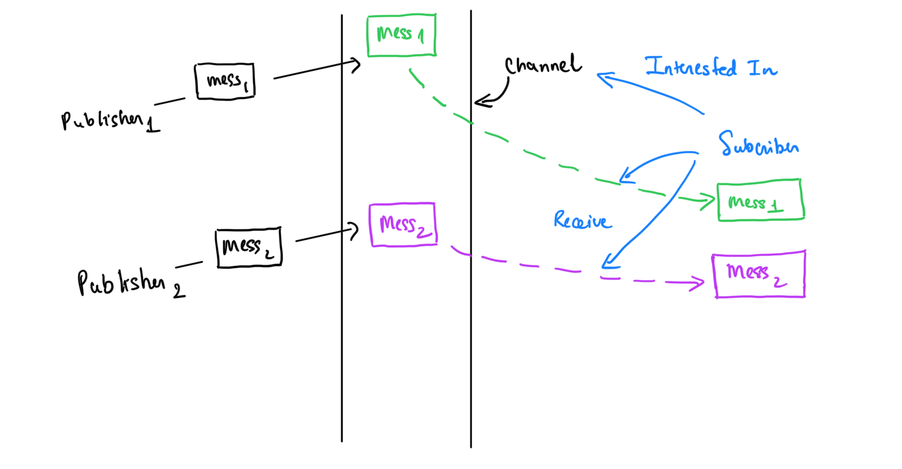

Code ví dụ cho trường hợp sử dụng socket-io dùng trong môi trường production (BE được deploy mutiple instance, và client trỏ tới BE qua load balance sử dụng round robin) -> sử dụng redis để broadcast giữa các instance

